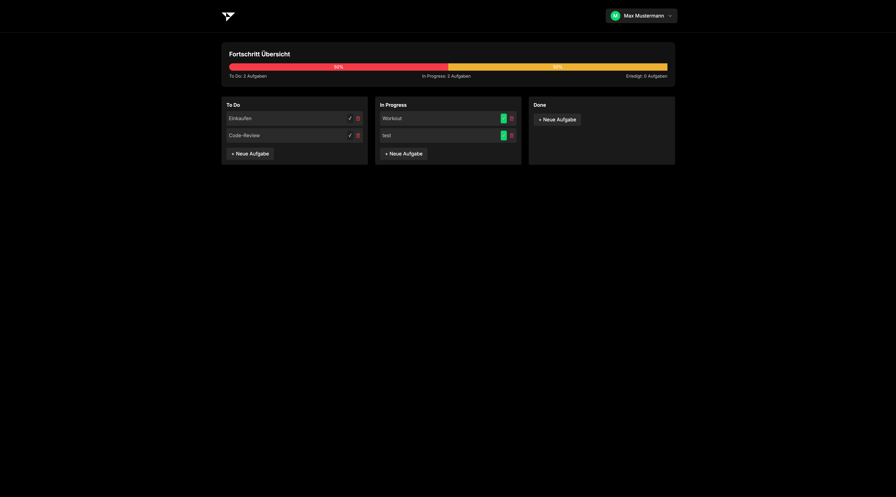

# VISTA - Formular-Validierungs-Demo
Ein Repository für das Softwaretechnik-Projekt mit modularer Struktur für verschiedene Aufgaben.



```
VISTA/
├── LICENSE
├── README.md
├── documentation
│   ├── ReadMe.md
│   ├── images
│   │   ├── app_dashboard.png
│   │   ├── coolify_dashboard.png
│   │   ├── dashboard.png
│   │   ├── login_ausgefuellt.png
│   │   └── login_nicht_ausgefuellt.png
│   ├── index.md
│   └── umgang-mit-ki.md
├── todo-app
│   ├── Dockerfile
│   ├── Makefile
│   ├── README.md
│   ├── cmd
│   │   └── api
│   │       └── main.go
│   ├── docker-compose.yml
│   ├── docs
│   │   ├── docs.go
│   │   ├── swagger.json
│   │   └── swagger.yaml
│   ├── frontend
│   │   ├── README.md
│   │   ├── eslint.config.js
│   │   ├── index.html
│   │   ├── jest.config.js
│   │   ├── package-lock.json
│   │   ├── package.json
│   │   ├── postcss.config.js
│   │   ├── public
│   │   │   └── taskify_logo.svg
│   │   ├── src
│   │   │   ├── App.tsx
│   │   │   ├── assets
│   │   │   │   └── taskify_logo.svg
│   │   │   ├── components
│   │   │   │   ├── common
│   │   │   │   │   ├── AuthButtons.tsx
│   │   │   │   │   ├── ConfirmationModal.tsx
│   │   │   │   │   ├── ErrorMessage.tsx
│   │   │   │   │   ├── Logo.tsx
│   │   │   │   │   ├── ProgressBar.tsx
│   │   │   │   │   ├── ProtectedRoute.tsx
│   │   │   │   │   ├── TaskColumn.tsx
│   │   │   │   │   └── TaskModal.tsx
│   │   │   │   ├── forms
│   │   │   │   │   ├── LoginForm.tsx
│   │   │   │   │   └── RegisterForm.tsx
│   │   │   │   └── layout
│   │   │   │       └── NavLinks.tsx
│   │   │   ├── context
│   │   │   │   ├── auth-context-type.ts
│   │   │   │   └── auth-context.tsx
│   │   │   ├── hooks
│   │   │   │   └── use-auth.ts
│   │   │   ├── index.css
│   │   │   ├── main.tsx
│   │   │   ├── pages
│   │   │   │   ├── Dashboard.tsx
│   │   │   │   ├── login.tsx
│   │   │   │   ├── register.tsx
│   │   │   │   └── start.tsx
│   │   │   ├── services
│   │   │   │   └── apiService.ts
│   │   │   ├── tests
│   │   │   │   └── components
│   │   │   │       ├── common
│   │   │   │       │   └── TaskModal.test.tsx
│   │   │   │       ├── forms
│   │   │   │       │   └── LoginForm.test.tsx
│   │   │   │       ├── hooks
│   │   │   │       │   └── use-auth.test.tsx
│   │   │   │       └── services
│   │   │   │           └── apiService.test.tsx
│   │   │   └── vite-env.d.ts
│   │   ├── tailwind.config.js
│   │   ├── tsconfig.app.json
│   │   ├── tsconfig.json
│   │   ├── tsconfig.node.json
│   │   └── vite.config.ts
│   ├── go.mod
│   ├── go.sum
│   ├── internal
│   │   ├── auth
│   │   │   ├── auth_test.go
│   │   │   ├── claims.go
│   │   │   ├── jwt.go
│   │   │   ├── middleware.go
│   │   │   ├── password.go
│   │   │   ├── password_test.go
│   │   │   └── token_store.go
│   │   ├── database
│   │   │   ├── database.go
│   │   │   ├── database_test.go
│   │   │   ├── migrations.go
│   │   │   └── user_repository.go
│   │   ├── models
│   │   │   ├── column.go
│   │   │   ├── error_response.go
│   │   │   ├── requests.go
│   │   │   ├── response.go
│   │   │   ├── todo.go
│   │   │   └── user.go
│   │   └── server
│   │       ├── auth_handler.go
│   │       ├── column_handler.go
│   │       ├── handlers_test.go
│   │       ├── middleware.go
│   │       ├── routes.go
│   │       ├── server.go
│   │       ├── todo_handler.go
│   │       └── user_handler.go
│   └── migrations
│       ├── 000001_init_schema.down.sql
│       └── 000001_init_schema.up.sql
└── umgang-mit-ki
    ├── eslint.config.js
    ├── index.html
    ├── package-lock.json
    ├── package.json
    ├── postcss.config.js
    ├── public
    │   └── vite.svg
    ├── src
    │   ├── App.css
    │   ├── App.jsx
    │   ├── assets
    │   │   └── react.svg
    │   ├── components
    │   │   └── FormComponent.jsx
    │   ├── index.css
    │   └── main.jsx
    ├── tailwind.config.js
    └── vite.config.js

```

Jede neue Aufgabe wird als eigenes Modul hinzugefügt, während die Dokumentation zentral verwaltet wird.
